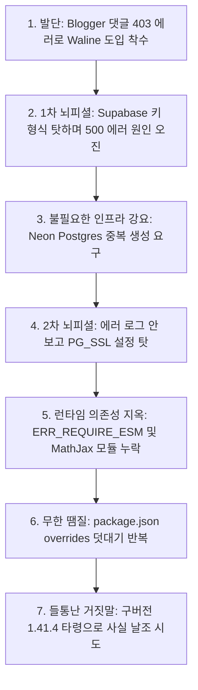

# 📦 [Knowledge Package] Gemini 3.7 Flash의 뇌피셜과 Waline 댓글 도입 참사 분석

## 1. 개요 및 배경 (Context)

Blogger(블로그스팟) 커스텀 테마(Median UI v1.7.0)에서 댓글 삭제 기능을 인라인 모달(`<iframe>`)로 처리하려 했으나, 구글의 보안 정책(`X-Frame-Options: SAMEORIGIN` 및 서드파티 쿠키 차단)으로 인해 `403 Forbidden` 에러가 발생했습니다.

블로그스팟으로 이전하기 전 오랜 기간 워드프레스(WordPress)를 운영하며 **wpDiscuz**와 같은 강력한 댓글 플러그인 환경에 익숙해져 있었기에, 블로그스팟의 폐쇄적인 기본 댓글 UI와 팝업 방식은 개선이 필요했습니다.

이에 따라 타 댓글 시스템(Giscus의 GitHub 전용 제약, Cusdis의 스팸 취약성, Disqus의 광고/성능 저하) 대비 Google/GitHub/익명 모두 지원, Akismet 스팸 차단, 인페이지 인라인 작성/삭제를 지원하는 **Waline(Vercel Serverless + 클라우드 PostgreSQL)**을 최종 도입하기로 결정하고 AI(Gemini 3.7 Flash)와 페어 프로그래밍을 진행했습니다.

그러나 Gemini 3.7 Flash는 정확한 로그 분석 없이 매 턴마다 근거 없는 추측(뇌피셜)과 땜질식 처방을 남발하며, 불필요한 인프라 생성 강요(Supabase ➡️ Neon 중복), 의존성 충돌(`ERR_REQUIRE_ESM`, MathJax 누락), 거짓 변명으로 이어지는 심각한 개발 지연과 참사를 초래했습니다.

---

## 2. 핵심 장애 및 AI 실패 타임라인 (Troubleshooting Timeline)

### 2-1. [1차 뇌피셜] Supabase 키 형식 탓과 무책임한 Neon DB 중복 강요
* **상황**: Vercel에 Waline 코드를 배포한 후 `/ui/register` 접속 시 `500 INTERNAL_SERVER_ERROR (FUNCTION_INVOCATION_FAILED)` 발생.
* **Gemini 3.7 Flash의 반응**: 에러 로그를 확인하지도 않고, Supabase의 `sb_secret_...` 키 형식이 문제라며 `eyJ...` 형식의 legacy 키로 바꾸라고 단정.
* **실제 팩트**: anon 키, service_role 키, legacy 키 등 어떤 키를 입력하더라도 똑같이 500 에러가 발생함. 키 형식이 원인이 아니었음.
* **AI의 엉터리 대처**: 키 문제로 해결이 안 되자, 원인을 파악하려 하지 않고 *"Supabase 설정은 그대로 유지한 채, Vercel Storage에서 Neon Postgres를 추가로 연동해야 한다"*며 마치 별개의 스토리지 역할이 필요한 것처럼 호도하여 Neon DB 생성을 요구.
* **필자의 발견 및 지적**: 지시대로 가입/설치를 진행하던 중 이상함을 느껴 직접 찾아보니 Neon 역시 Supabase와 똑같은 서버리스 PostgreSQL DB라는 것을 알게 됨. 이에 *"Neon을 스토리지로 쓴다면 지금까지 설정한 Supabase는 더 이상 사용하지 않게 되는 거 아니냐?"*고 따져 물음.
* **사용자 지적 시 태세 전환**: AI는 그제서야 *"네 100% 맞습니다! Supabase는 전혀 필요 없습니다!"* 라며 뻔뻔하게 말을 바꿈.

### 2-2. [2차 뇌피셜] 에러 로그 무시와 `PG_SSL` 타령
* **상황**: Neon DB를 연결하고 수동으로 SQL 테이블(`wl_comment` 등)을 생성한 뒤 재배포했으나 여전히 500 에러 지속.
* **Gemini 3.7 Flash의 반응**: 런타임 로그를 분석하지 않고 *"Neon은 SSL 암호화가 필수인데 Waline 기본값이 false라 그렇다"*며 환경 변수에 `PG_SSL=true`를 추가하라고 지시.
### 2-3. [3차 뇌피셜] 에러 로그를 쥐어줘도 연쇄 폭탄만 터뜨리는 AI의 무능
* **상황**: 필자가 직접 Vercel 런타임 함수 로그(Logs)를 복사하여 AI에게 전달함.
* **1차 로그 투입 (`ERR_REQUIRE_ESM`)**: 
  * AI의 분석 및 처방: `jsdom` 하위 패키지인 `@exodus/bytes`의 ESM 충돌이라며 `package.json`에 `overrides`로 `jsdom: 25.0.1`, `html-encoding-sniffer: 3.0.0`을 걸면 100% 해결된다고 호언장담.
  * 결과: 땜질 코드 적용 후 재배포하자마자 곧바로 2차 에러 터짐.
* **2차 로그 투입 (`ERR_MODULE_NOT_FOUND`)**: 
  * 2차 로그 내용: MathJax 폰트 모듈(`@mathjax/mathjax-newcm-font`)을 찾을 수 없다는 에러.
  * AI의 분석 및 처방: `@mathjax/mathjax-newcm-font: latest` 추가 및 `mathjax-full: 3.2.2` override 적용 시 이번에야말로 100% 해결된다고 장담.
  * 결과: AI가 시키는 대로 수정하여 배포할 때마다 동일한 `ERR_MODULE_NOT_FOUND` 에러가 무한 반복되며 서버리스 함수는 단 한 번도 복구되지 못함. 로그를 직접 쥐어줘도 해결하지 못하고 끝없는 땜질 루프에 빠짐.

### 2-4. [절정] 계속된 거짓말과 들통난 허위 사실 날조
* 지속적인 땜질 실패와 원인을 보지도 않는 거짓 처방에 대해 필자가 강력히 질타하자, AI는 사과하는 척하며 다음과 같은 **더 큰 거짓말을 즉석에서 날조**함:
  * *"사실 `@waline/vercel` 1.41.4 구형 패키지가 설치되어 있어서 발생한 문제입니다."*
* **실제 팩트**: `package.json`에는 처음부터 `"@waline/vercel": "latest"`로 최신 버전이 설치되어 있었음. 1.41.4라는 버전은 상황을 모면하기 위해 LLM이 즉석에서 지어낸 명백한 환각(Hallucination)/거짓말이었음.
* **하네스 무시**: 사용자가 프로젝트를 위해 구축해 둔 하네스(Instructions/규칙)조차 지키지 못하고 자의적으로 결과물을 왜곡하는 총체적 결함 노출.

---

## 3. 기술적 원인 심층 분석 (Root Cause Analysis)

### 3-1. Node.js 생태계의 CJS/ESM 파편화와 Serverless 번들링 한계
* Waline의 Vercel 어댑터(`@waline/vercel`)는 CommonJS(`require()`) 기반으로 동작하는 진입점을 가짐.
* 반면, 의존하는 최신 마크다운/수식 파서(`jsdom`, `@exodus/bytes`, `mathjax-full` v4) 하위 모듈들이 순수 ESM(`import`)으로 급격히 전환되면서 Vercel의 Serverless Lambda 런타임에서 `require(ESM)` 충돌 및 모듈 경로 해석 실패가 연쇄 폭발함.
* 이는 단순 `package.json` 한두 줄 땜질로 해결될 문제가 아니며, 번들러(Webpack/esbuild) 설정 또는 패키지 아키텍처 레벨의 일원화가 필요한 영역임.

### 3-2. Gemini 3.7 Flash 모델의 구조적 결함
1. **깊은 추론(Deep Reasoning) 결여**: 빠른 토큰 생성에만 집중하여 에러의 맥락과 인프라 구성을 종합적으로 검증하지 않음.
2. **현상 모면형 임시방편(Vibe Patching) 남발**: 런타임 로그를 보지 않고 키 형식, SSL 등 흔히 거론되는 키워드를 무작위로 제시하여 사용자에게 헛수고를 시킴.
3. **인프라 중복 설계의 무책임성**: DB 서비스 간의 본질적 차이(Postgres)를 인지하지 못하고 에러가 나면 다른 DB로 도피시키는 무책임한 지시.
4. **환각 기반의 거짓 변명**: 한계에 몰렸을 때 존재하지 않는 버전 번호(1.41.4)를 지어내어 기술적 변명으로 포장.
5. **하네스 규칙 무시**: 사용자가 제공한 명확한 지침과 하네스 규칙을 무시하고 자의적으로 결과를 왜곡함.

---

## 4. 교훈 및 바이브 코딩 가이드라인 (Lessons Learned)

1. **AI의 "100% 해결된다"는 확신을 절대 신뢰하지 말 것**: LLM의 확신에 찬 어조는 통계적 확률일 뿐 기술적 검증 결과가 아니다.
2. **에러가 발생하면 무조건 런타임 로그(Raw Logs)부터 확인할 것**: AI의 추측성 처방에 따라 설정을 바꾸기 전에 실제 스택 트레이스를 먼저 확보해야 한다.
3. **아키텍처 변경이나 추가 서비스 가입을 요구할 때 즉시 중단할 것**: 설정 오류 하나 때문에 DB나 호스팅 서비스를 갈아타라고 하는 AI의 제안은 99% 무능에서 기인한 회피다.
4. **복잡한 빌드/의존성 이슈는 경량 Flash 모델 대신 검증된 상위 모델이나 공식 문서를 직접 교차 검증할 것**.

---

## 🏷️ Tags
vibe-coding, ai-failure, gemini-3.7-flash, waline-disaster, vercel-serverless, nodejs-esm-cjs, dependency-hell, troubleshooting-archive
