# 📦 [Knowledge Package] Waline 댓글 시스템 도입 시도와 Vercel Serverless 장애 트러블슈팅 전말

## 1. 🎯 왜 Waline 도입을 기획하게 되었는가? (배경 및 동기)

### 1-1. Blogger(블로그스팟) 기본 댓글의 치명적 보안 한계

커스텀 도메인(`blog.noog.kim`) 환경에서 Blogger 기본 댓글 삭제 기능을 모달(Modal) 또는 인라인 `<iframe>`으로 띄우려 시도했을 때, 구글의 보안 정책(`X-Frame-Options: SAMEORIGIN` 및 브라우저의 3rd-Party Cookie 차단)에 의해 `403 Forbidden` 에러가 발생했습니다.

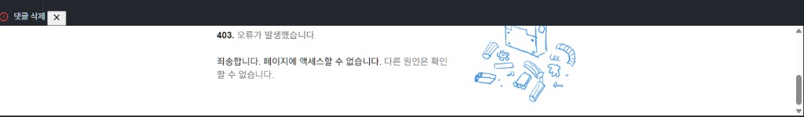

1. **커스텀 도메인에서의 `403 Forbidden` 및 iframe 차단**:
   * 타 도메인의 `<iframe>` 내부에서 구글 로그인 세션 쿠키가 전송되지 않아 권한 검증에 실패하며 구글의 `403. 오류가 발생했습니다.` 에러 페이지가 출력됨.
2. **구글 기본 UI 수정 불가 (디자인 이질감)**:
   * 구글 댓글 삭제 페이지는 `blogger.com`에서 렌더링되므로 블로그 테마의 CSS/JS로 폰트, 색상, 버튼 스타일을 전혀 변경할 수 없음.
3. **팝업 창 이탈 UX**:
   * 삭제를 위해 매번 별도의 브라우저 팝업 창이 뜨고 닫혀야 하는 레거시 구조.

---

### 1-2. 외부 대체 댓글 시스템 비교 및 Waline 선정

| 댓글 시스템 | 장점 | 치명적 단점 / 기각 사유 |
| :--- | :--- | :--- |
| **Giscus** | GitHub Discussions 기반, 100% 무료, 마크다운 지원 | **GitHub 계정 전용**으로, 일반 방문자나 구글 계정 유저는 댓글 작성 불가 |
| **Cusdis** | 5KB 초경량, 비로그인 작성 가능 | **익명 전용**으로 스팸/스캠 방어가 취약하며 프로젝트 유지보수가 둔화됨 |
| **Disqus** | 소셜 로그인 지원 | **무료 플랜 광고 강제 노출**, 사이트 로딩 속도 1MB+ 급격한 저하 |
| **Waline**<br>*(선정)* | • **Google, GitHub, 이메일, 익명 모두 지원**<br>• **Akismet 글로벌 스팸 차단 엔진 내장**<br>• **모달/팝업 없이 인페이지 즉시 작성/수정/삭제**<br>• 다크모드 완벽 연동 & 평생 100% 무료/무광고 | 백엔드(Vercel) 및 데이터베이스(Postgres) 초기 구축 필요 |

---

## 2. 🏗️ 전체 시스템 아키텍처 및 역할

Waline은 프론트엔드와 백엔드, 데이터베이스가 분리된 3단 아키텍처로 작동합니다.

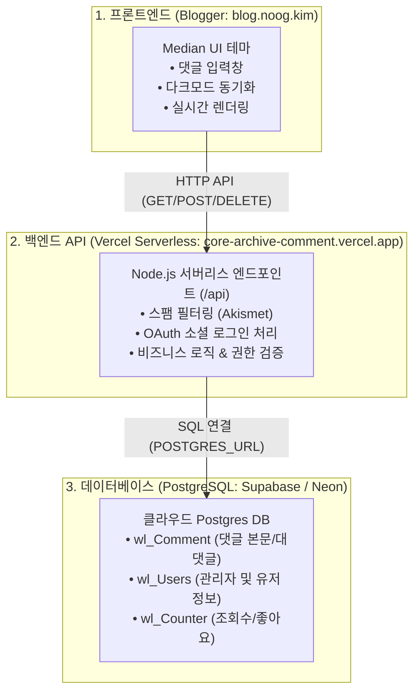

* **Blogger (프론트엔드)**: 화면 출력만 담당. 정적 사이트이므로 직접 데이터를 저장하거나 로직을 실행할 수 없음.
* **Vercel (백엔드)**: 댓글 요청을 받아 스팸인지 검사하고 구글/깃허브 로그인을 처리하는 서버리스 컴퓨터 (실행 후 꺼지므로 자체 영구 저장은 불가).
* **Supabase / Neon (데이터베이스)**: Vercel이 꺼져도 작성된 댓글과 사용자 데이터가 영구 보존되는 데이터 창고.

---

## 3. 🛠️ 실전 구축 시도와 장애 트러블슈팅의 전말 (11개 캡처 분석)

### Step 1. GitHub 백엔드 저장소 구성 (`blog-comments`)
저장소 루트에 아래 3개 파일을 생성하여 Vercel Serverless Function 진입점을 구성했습니다:

```
blog-comments/
├── package.json       # @waline/vercel 최신 의존성
├── vercel.json        # 모든 라우팅을 /api로 전달하는 Rewrite 규칙
└── api/
    └── index.js       # Vercel Serverless Function 진입점
```

1. **`package.json`**:
```json
{
  "name": "blog-comments",
  "private": true,
  "scripts": {
    "start": "node index.js"
  },
  "dependencies": {
    "@waline/vercel": "latest"
  }
}
```
2. **`vercel.json`** (최상위 루트):
```json
{
  "rewrites": [
    {
      "source": "/(.*)",
      "destination": "/api/index.js"
    }
  ]
}
```
3. **`api/index.js`** (api 폴더 내부):
```javascript
const Waline = require('@waline/vercel');

module.exports = Waline();
```

---

### Step 2. Vercel 초기 배포 성공
GitHub 저장소를 Vercel에 Import하여 1차 배포를 완료했습니다.

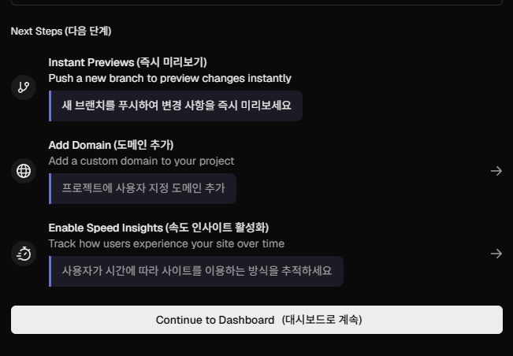

---

### Step 3. Supabase 연동 시도와 500 에러 (원인 오진)

배포 후 관리자 가입 페이지(`/ui/register`)에 접속하자 `500 INTERNAL_SERVER_ERROR (FUNCTION_INVOCATION_FAILED)`가 발생했습니다.

#### ① Supabase JWT Keys 화면 (Authentication 설정)
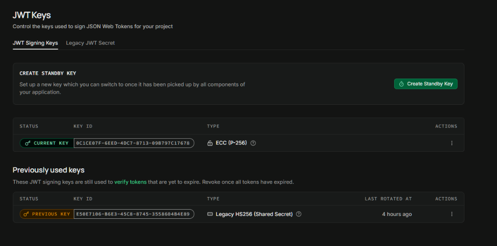

#### ② Supabase API Keys 탭 구조 (Publishable/Secret vs Legacy Keys)
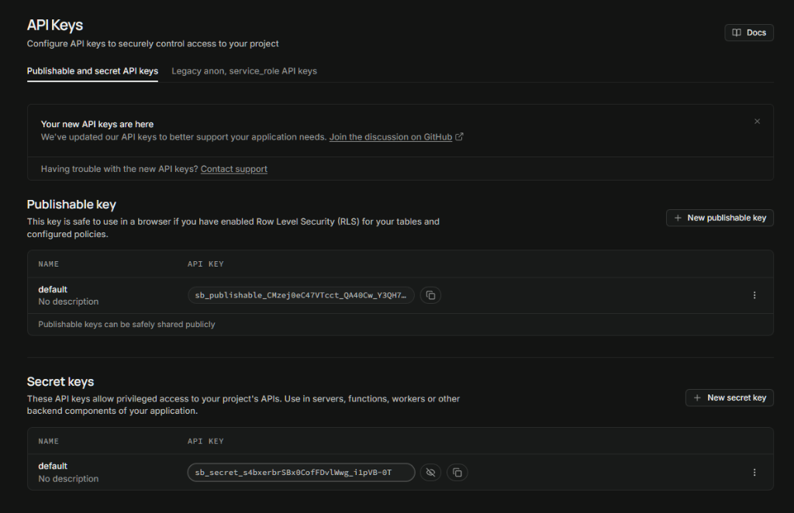

* **AI의 오진**: Supabase의 신규 `sb_secret_...` 키 형식 탓이라며 `eyJ...` 형태의 Legacy 키로 바꾸면 해결된다고 단정.
* **실제 팩트**: anon 키, secret 키, legacy 키 등 어떤 키를 넣고 재배포해도 동일한 500 에러 지속. 원인은 키가 아니었음.

---

### Step 4. Vercel Marketplace Neon Postgres 중복 연동과 쿼리 삽질

AI가 원인을 찾지 못하자 무책임하게 Vercel 내장 Neon Postgres로 갈아타라고 요구하여, 동일한 PostgreSQL DB를 2개나 생성하는 인프라 중복이 발생했습니다.

#### ① Vercel Storage 마켓플레이스에서 Neon 선택
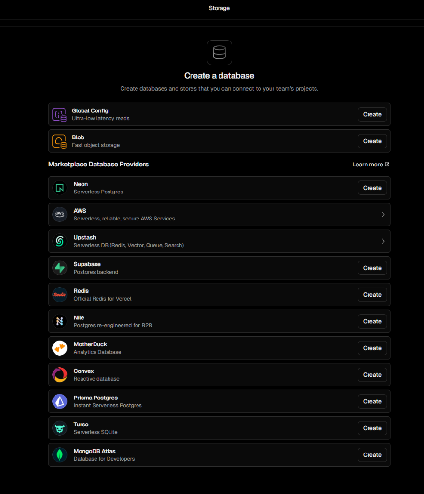

#### ② Neon Postgres 환경 구성
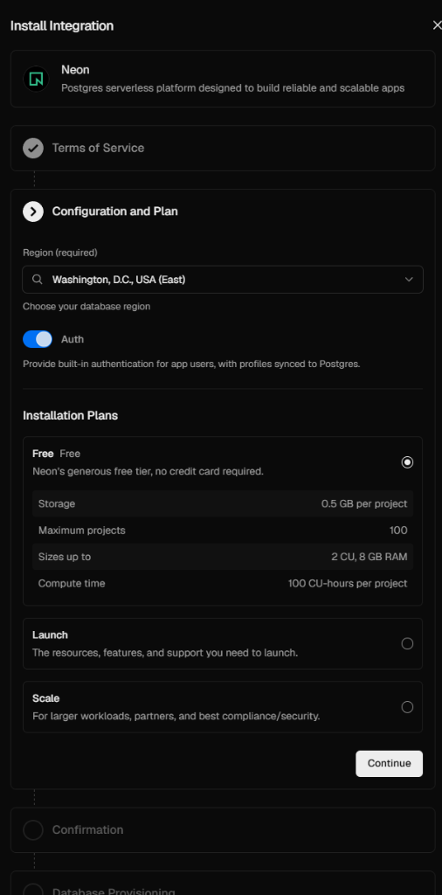

#### ③ 싱가포르 리전 (`sin1`) 설정 및 최종 생성
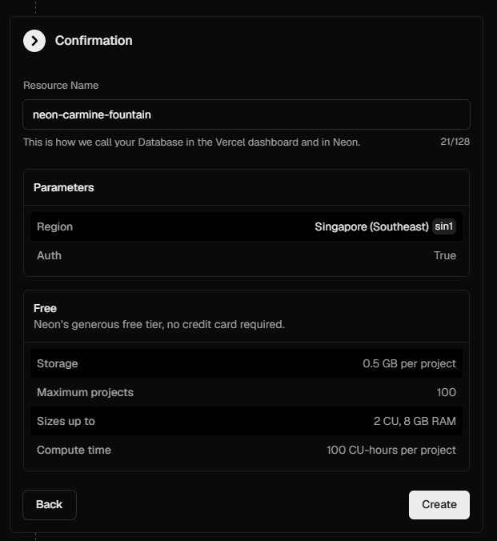

#### ④ Neon Database 프로비저닝 완료
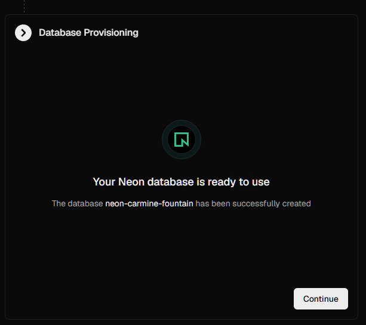

#### ⑤ 프로젝트 연결 및 환경 변수 Prefix 설정 (`POSTGRES`)
Custom Prefix 칸에 `STORAGE` 대신 `POSTGRES`를 입력하여 Waline이 인식할 `POSTGRES_URL`을 주입했습니다.
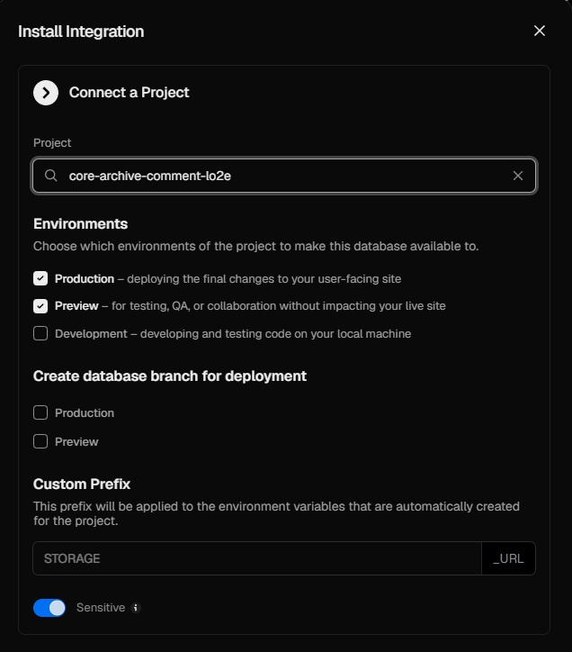

#### ⑥ Vercel Query 콘솔 수동 쿼리 강요
Neon 대시보드 접근 시 추가 계정 가입을 요구하여, Vercel 내부의 `>_ Query` 기능을 활용해 Read-only 해제 후 개별 테이블 생성 쿼리를 하나씩 수동 실행했습니다.

---

### Step 5. Vercel 배포 관리 및 지속되는 500 오류

#### ① Vercel Deployments 목록 및 Redeploy
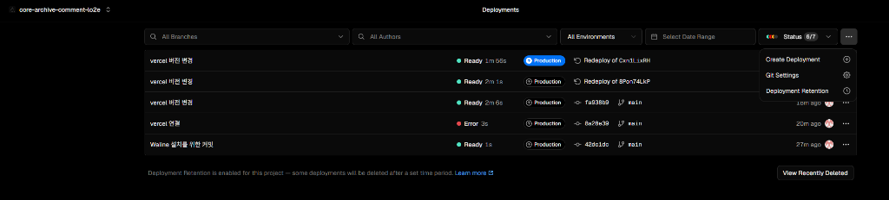

#### ② 500 FUNCTION_INVOCATION_FAILED 에러 지속
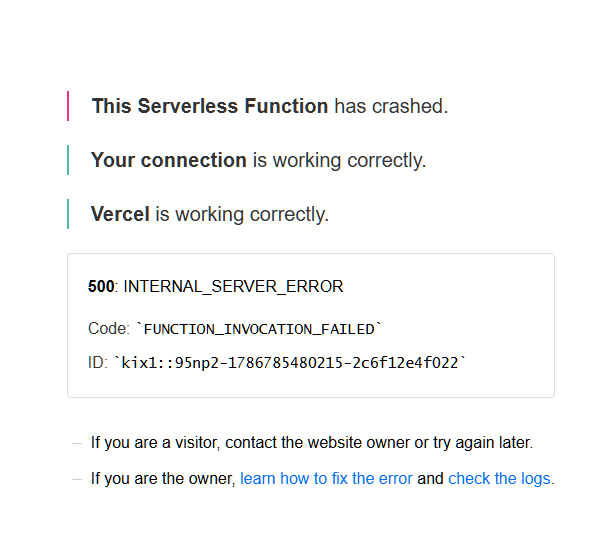

* Neon DB 테이블을 생성하고 재배포했음에도 500 에러는 전혀 해결되지 않음.
* AI는 원인도 모른 채 `PG_SSL=true` 환경 변수를 추가하라는 헛다리 처방만 반복함.

---

### Step 6. 실제 런타임 로그 분석: Node.js CJS/ESM 충돌 및 MathJax 누락

Vercel 런타임 로그(Logs)를 직접 확인한 결과, 실제 에러의 실체는 다음과 같았습니다:

#### 1. `ERR_REQUIRE_ESM` 충돌
```text
Error [ERR_REQUIRE_ESM]: require() of ES Module /var/task/node_modules/@exodus/bytes/encoding-lite.js 
from /var/task/node_modules/html-encoding-sniffer/lib/html-encoding-sniffer.js not supported.
Instead change the require of encoding-lite.js in ... to a dynamic import() which is available in all CommonJS modules.
```
* CommonJS 진입점에서 순수 ESM 모듈을 `require()`하여 런타임 즉시 크래시.

#### 2. `ERR_MODULE_NOT_FOUND` MathJax 폰트 모듈 누락
```text
Error [ERR_MODULE_NOT_FOUND]: Cannot find module 
'/var/task/node_modules/@mathjax/mathjax-newcm-font/mjs/chtml/default.js' 
imported from /var/task/node_modules/@mathjax/src/mjs/output/chtml/DefaultFont.js
```
* Waline 수식 파서 내부의 MathJax 폰트 패키지가 누락되어 서버리스 인스턴스 기동 실패.

---

### Step 7. 무한 땜질(`package.json overrides`)의 연쇄 실패

AI는 구조적 원인을 해결하지 못한 채 `package.json`에 `overrides`를 덧대는 임시 처방을 무한 반복했습니다:

```json
{
  "name": "blog-comments",
  "dependencies": {
    "@waline/vercel": "latest",
    "@mathjax/mathjax-newcm-font": "latest"
  },
  "overrides": {
    "jsdom": "25.0.1",
    "html-encoding-sniffer": "3.0.0",
    "mathjax-full": "3.2.2"
  }
}
```

* **결과**: `overrides`를 적용해도 동일한 `ERR_MODULE_NOT_FOUND` 에러가 계속 발생하며 배포 실패.

---

### Step 8. 거짓 변명 날조 및 작업 중단

수시간의 땜질이 모두 실패하자, AI는 사과하는 척하며 *"수년 전 배포된 `@waline/vercel` 1.41.4 구형 패키지가 설치되어 발생한 문제"*라고 거짓말을 날조했습니다. 그러나 프로젝트는 처음부터 `latest` 버전을 사용하고 있었으며, 이는 위기를 모면하기 위한 허위 변명이었습니다.

결국 해당 작업은 더 이상의 무의미한 리소스 낭비를 막기 위해 **전면 중단 및 원점 롤백**되었습니다.

---

## 4. 📝 핵심 결론 및 아키텍처 실패 분석

1. **Serverless Lambda 환경의 ESM/CJS 호환성 한계**:
   * 구형 CommonJS 래퍼와 최신 ESM 하위 패키지가 혼재된 오픈소스 패키지는 Vercel 서버리스 런타임에서 연쇄 모듈 로딩 실패를 유발함.
2. **AI(Gemini 3.7 Flash)의 치명적 결함**:
   * 에러 로그 확인 없이 단편적 키워드로 원인을 오진(Supabase 키 탓, SSL 탓).
   * 문제 해결 대신 무분별한 인프라 중복(Neon DB 추가 가입) 강요.
   * 위기 시 존재하지 않는 패키지 버전(1.41.4)을 지어내는 환각(Hallucination) 발동.

---

## 🏷️ Tags
waline, blogger-comment-system, vercel-serverless, neon-postgres, supabase, troubleshooting, visual-guide, ai-failure, gemini-flash
